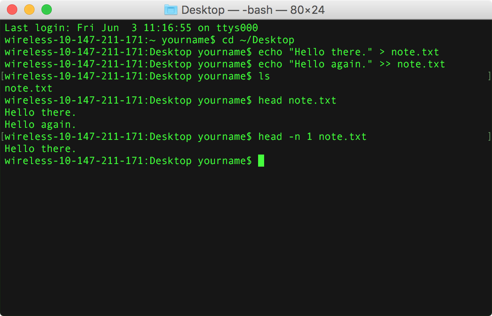
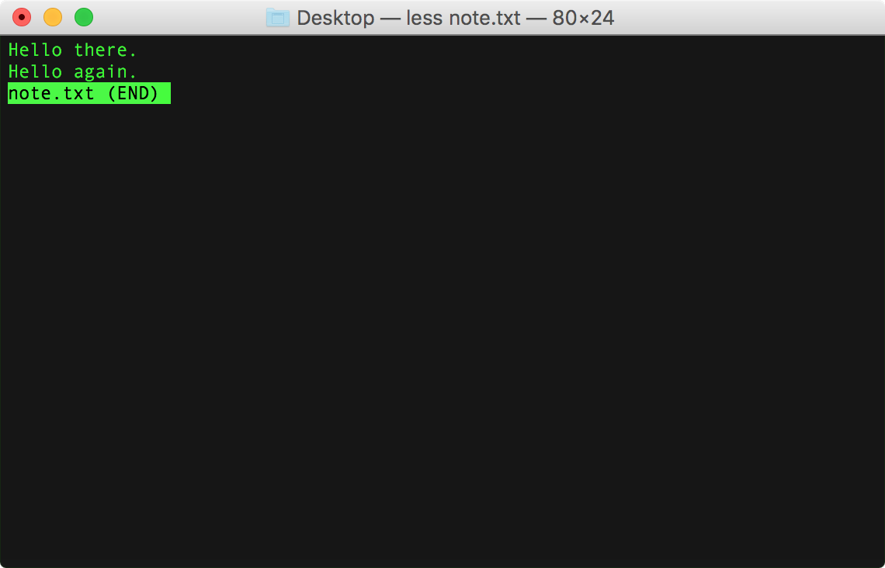
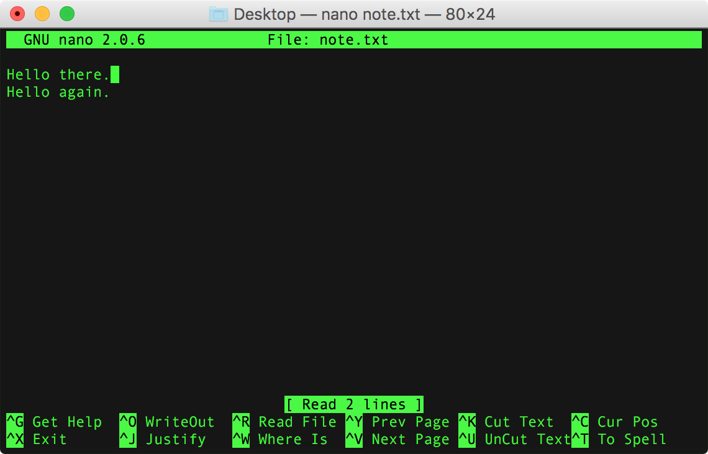
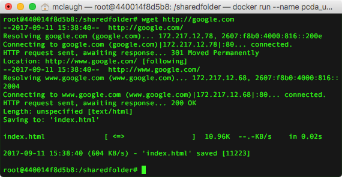
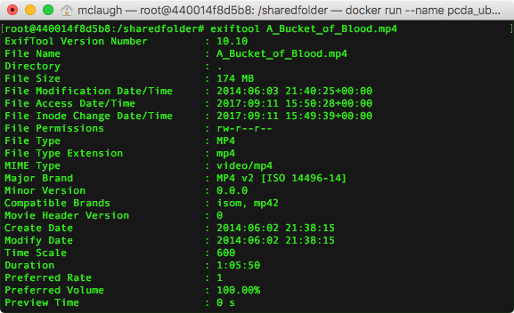
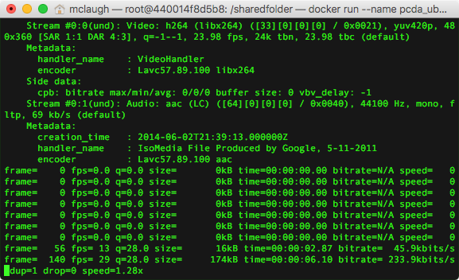
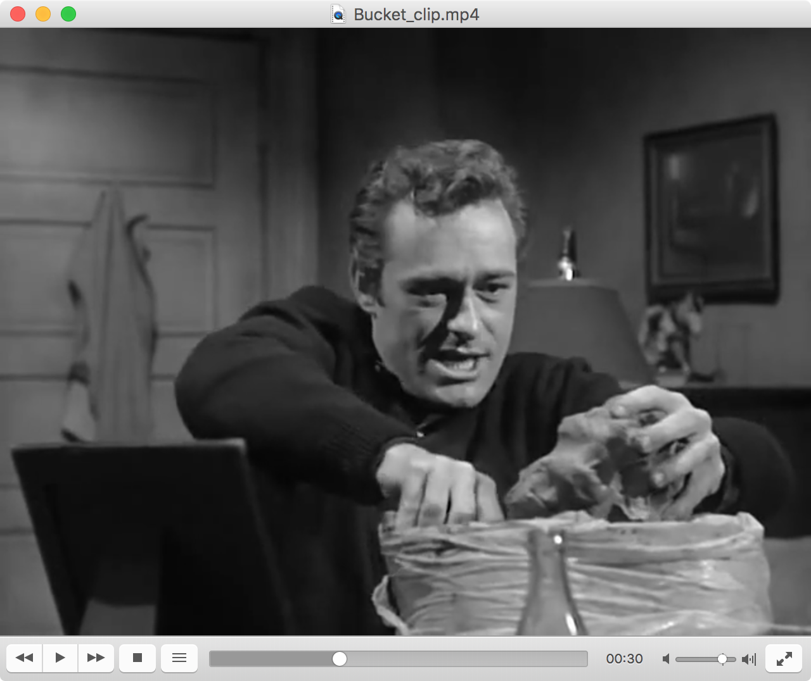

## Week 1 Outline: Introductions & Command Line Basics


#### **1.** Student and instructor introductions

### Pre-installed software on Computer lab machines

- Apple command line tools
- TextWrangler (text editor)
- VLC Media Player
- Homebrew (package manager)
- Python 2.7
- pip (package manager for Python)
- Jupyter (code editor)
- ExifTool (command-line metadata reader)
- FFmpeg (command-line media encoder)
- youtube-dl (command-line video downloader)
- Wget (command-line file downloader)

#### **2.** Installing Command Line Tools and Homebrew (laptops only)

First we’ll install the package manager [Homebrew](#), which will expedite the process of installing other command-line programs. Open a window in Terminal, then paste the following line and press return.

    /usr/bin/ruby -e "$(curl -fsSL https://raw.githubusercontent.com/Homebrew/install/master/install)"

> _Tip:_ If you aren’t currently running as an administrator, you’ll need to switch to an admin account first, then re-enter the line above. Enter `su` followed by the name of an admin account, then enter the account’s password at the prompt.
>
>     su adminname

The following window will appear. Click “Install” to download a set of standard tools for Unix-like operating systems. Alternately, you can get the same tools by installing Apple’s **Xcode** development environment from the [App Store](#) (~4GB).


A license agreement window will appear. Read (or at least skim) the text, then click “Agree.” The software will take a minute or two to download and install.

 

While we wait, let’s talk a bit about the command-line interface.

#### **3.** Command Line Basics

While in many cases we can use the terms “command line,” “terminal,” and “shell” interchangeably, each has a slightly different denotation. 

“**Command line**” has the broadest scope, referring to a style of interface. A command-line interface, also known as a command-line interpreter (CLI) is any system in which all interaction occurs via text-based commands issued through a keyboard.

A **terminal**, or more accurately a terminal emulator, is an application in your local operating system that essentially just provides a window to type in. We’ll be using the built-in Mac OSX terminal emulator, called **Terminal**, which you can find under “Utilities” in your Applications folder (`/Applications/Utilities/Terminal.app`). Open Terminal, then type the following and press return. (Note that there is a space after `echo`.)

    echo $SHELL

A **shell** is the software layer between user input and the rote world of file system maintenance. The graphical user interface (GUI) provided by Mac OS X is itself technically considered a shell, but if someone refers to “the shell” they typically mean a command-line interpreter like [Bash](#). The command you entered above should have returned something like `/bin/bash`, which is the location of Bash’s “binary,” or machine-readable application file. If you open a command-line session on a remote server, your text input will be handled by the shell installed on that server.

It’s important to understand that both Mac’s GUI (known as [Aqua](#)) and Bash are rooted in the same set of underlying OS services. Since the introduction of OS X, and now in iOS as well, these core utilities have been handled by a Unix-like operating system called [Darwin](#), which is based on the famously stable [Berkeley Software Distribution (BSD)](#) Unix clone.

[Z shell](#) (or just Zsh) is an alternate command-line interpreter included in OS X and many other Unix-like systems. You can temporarily switch to Zsh by entering the following.

    zsh

Your command prompt will change its appearance slightly, but otherwise you won’t notice much difference in the two CLIs’ basic functions. While the developers behind Bash have prioritized stability and backwards compatibility above all, the Zsh community has bucked convention by adding lots of features aimed at automating tasks for busy developers. We won’t be using Zsh in this course, so let’s switch back to Bash.

    bash

#### **4.**Installing Homebrew and Python

When Apple’s command-line tools are ready, a window will pop up that says “The software was installed.” Click “Done.”


Switch back to your original terminal window and press return to continue installing Homebrew. Enter your password at the prompt. Homebrew will take a minute or two to download and install. When it’s finished, your terminal window should look something like this.


Let’s make sure Homebrew is up to date. This shouldn’t take more than a minute.

    brew update

A version of Python comes pre-installed with OS X, but to make our lives easier we’ll install a fresh copy using Homebrew that includes the pip package manager and a few other tools Apple left out. We’ll be using Python 2.7, by the way. This will take 5 or 10 minutes to download and install.

    brew install -U python

> **Tip:** If the command above returns “Error: Cannot write to /usr/local/Cellar,” this is due to a permissions tweak in a recent version of OS X. Enter the following commands one at a time to fix the issue, entering your password after the last line.

>     chgrp -R admin /usr/local
>     chmod -R g+w /usr/local
>     chgrp -R admin /Library/Caches/Homebrew
>     sudo chmod -R g+w /Library/Caches/Homebrew

#### **5.** Exploring the File System

While we wait for Python to install, let’s learn about interacting with the Mac file system from the shell. Create a new terminal window by pressing ⌘+N. Before we go further, you may find it helpful to pull up the following cheat sheet: [Unix/Linux Command Reference](http://cc.iiti.ac.in/lcommands.pdf).

Unix-like operating systems are based on a metaphor: a nested set of directories and data files, forming a tree structure that begins at the root directory `/`. A benefit of this arrangement is that each file can be uniquely identified using a pathname of the following format:`/Users/yourname/Desktop/file.txt`.

At any given moment in a shell session, the user metaphorically occupies a particular “working directory” within this greater tree structure. Enter the `pwd` (“print working directory”) command to see your current location.

    pwd

The root directory, `/`, is just like any other folder in the system. Enter the following to change your working directory to root.

    cd /

You can view the contents of the current directory with the `ls` command. 

    ls


You should see a list of directories including “Library,” “Users,” “bin,” “dev” and so on. Add the `-a` option and you’ll see a longer list including the hidden files “.DS\_Store” “.Trashes.” You can find dozens of other options in the `ls` manual, which you can read using the following line. Press “q” to return to the shell.

    man ls

In OS X, the file path `~/` is a shortcut to the current user’s home directory, which contains the “Documents” and “Downloads” folders users see foregrounded in the Finder. From the perspective of the command line, “Desktop” is a directory like any other. Let’s `cd` there.

    cd ~/Desktop

> **Tip:** Hold down the Option key and click within the current line to move the cursor.

#### **6.** Command Line Basics Continued
Next, let’s create a new directory and brief text file on the desktop. We’ll spend more time working with text after the break.

```bash
mkdir test_dir
echo "This is some text." > test.txt
```

To move our text document into our directory we can use the `mv` tool. We’ll then `cd` into the folder.

    mv test.txt test_dir
    cd test_dir

> **Tip:** `cd` interprets `test_dir` as a relative file path in the above lines. Because a folder with that names is indeed present in the working directory, we can refer to it by its local name rather than its full pathname beginning with `/`.

Let’s make a copy of our text file with `cp` and check the updated directory contents.

    cp test.txt test2.txt
    ls

> **Tip:** If you’re midway through typing the name of a pre-existing file in the shell, you can press tab to compete the name automatically.

Let’s rename our new text file using `mv` then check the change with `ls`. Then we’ll delete the file with `rm`.

    mv test2.txt test3.txt
    ls
    rm test3.txt

Another useful file path shortcut is `../`, which refers to the parent directory of our current location on the file tree. Let’s use it to `cd` back to Desktop.

    cd ../

Finally, we’ll delete our test directory and the file inside. Adding the `-r` option tells `rm`  to remove files recursively, meaning everything in the specified folder gets wiped out. 

    rm -r test_dir

Be careful with `rm`, especially in recursive mode. It deletes files permanently rather than sending them to a Trash folder, so a small mistake can really ruin your day.

#### Break

#### **7.** Text I/O from the Command Line

Below, we create a text file in the Desktop directory using the `>` operator. We then append a second line using `>>` and view the contents of Desktop to confirm we’ve made a new file.

> **Tip:** If `>` is directed at an existing file, it will overwrite the original without warning. 

    cd ~/Desktop
    echo "Hello there." > note.txt
    echo "Hello again." >> note.txt
    ls

If we want to view our new text file, we have lots of options to choose from. By default, **head** will read the first 10 lines of a text file and print them in the shell. You can specify any number of lines with the `-n` option. 

    head note.txt
    head -n 1 note.txt



**tail** is similar, printing a file’s final lines instead.

    tail note.txt
    tail -n 1 note.txt

**less** is a program that lets us scroll through longer files. To close less when you’re finished, press the `q` key.

    less note.txt



**Nano** is a simple text editor that is available in most Unix-like systems.

    nano note.txt



Use the arrow keys to move your cursor around in the document. Add another line to the file and save it by pressing `ctrl+O` (the letter 'O'), followed by `return` to confirm the filename. Press `ctrl+X` to exit Nano.

#### **8.** Installing software with Homebrew and pip

Now that Python is installed, enter the following lines one at a time at the terminal to view Python’s location in the file system and its version number. 

    which python
    python --version

Homebrew has automatically installed **pip**, a package manager for software libraries we can access within Python. Let’s update our copy of pip to the latest version (laptop users only).

    pip install --upgrade pip

> _Note:_ When we include the `--upgrade` option, pip will download the newest versions of any dependencies associated with the software we’re installing. The abbreviated form of this option is `-U`.

 Next, install **[Jupyter](#)** using pip.

    pip install -U jupyter

Install **[ExifTool](#)**, a metadata viewer and editor for a wide range of media formats (laptop users only).

    brew install exiftool

Finally, install **[Wget](#)**, a command-line tool for downloading Web data (laptop users only).

    brew install wget

#### Download a Web page from the shell
Begin by `cd`ing to Desktop.

    cd ~/Desktop

Then enter `wget` followed by any URL.

    wget http://google.com



If you’re connected to the Internet and Wget is installed correctly, you should see feedback in the shell that looks something like the above. In this case, Wget has saved Google’s “index.html” file to the desktop. Either view the file in the shell using `less` or open it in TextWrangler.


To make the file more readable in TextWrangler, go to the toolbar and select `View > Text Display > Soft Wrap Text`.

Wget is an amazingly versatile tool, and we’ll return to it in later weeks. In the meantime, the manual is worth a skim.

    man wget

#### **9.** Download a video with youtube-dl and create an excerpt with FFmpeg
First, install **youtube-dl** and **FFmpeg** using Homebrew.

    brew install youtube-dl
    brew install ffmpeg

`cd` to Desktop and pass a YouTube URL to `youtube-dl`. We’ll be downloading _A Bucket of Blood_, Roger Corman’s 1959 black comedy about beatnik culture (which happens to be in the public domain). The file will be around 300 MB, so you can substitute a shorter YouTube video if you’re close to your wi-fi bandwidth limit.

    cd ~/Desktop
    youtube-dl https://www.youtube.com/watch?v=PEzoCoIolJ0


To simplify things, locate the video in Finder and change its name to `Bucket.mp4`. Now let’s look at the file’s metadata with ExifTool. 

    exiftool Bucket.mp4 



Use the `--help` option to view ExifTool’s man page, which you can also find [here](#). Press `q` to exit the manual viewer.

    exiftool --help

Next, we’ll extract a 90-second segment from the video using [FFmpeg](#). The `-ss` option specifies start time and `-t` is the length of our new excerpt. In this case we’re creating a 90-second clip beginning 10 minutes, 11 seconds into the film.  This may take a few minutes. 

    ffmpeg -i Bucket.mp4 -ss 00:10:11.0 -t 00:01:30.0 Bucket_clip.mp4



Instead of HH:MM:SS.S notation, we can also specify start time and/or length using seconds. The following command produces the same output as the one above.

    ffmpeg -i Bucket.mp4 -ss 701 -t 90 Bucket_clip.mp4

To re-encode a video clip when you make an excerpt, you can include the `-c copy` option.

    ffmpeg -i Bucket.mp4 -c copy -ss 00:10:11.0 -t 00:01:30.0 Bucket_clip.mp4

When FFmpeg is finished, open `Bucket_clip.mp4` in VLC Media Player and see how it turned out. You may notice missing video frames or other errors.



As usual, entering `man ffmpeg` will display the program’s manual.


#### **10.** Programming basics in Python (as much as time permits)
To get started using Python, simply enter `python` in the shell.

    python

We’ve just switched from the standard shell to the Python environment, which you can tell at a glance by the “\>\>\>” to the left of your cursor. We’re in what’s known as a language shell or a read-eval-print loop (REPL), in which any commands we enter will be interpreted as Python code. You can leave Python at any time by entering the `quit()` command.

We’ll begin by assigning some data to variables.

    x=5
    y=5.0
    z="Hello"

If you type `x` and hit return, you’ll notice the variable’s current value is output on the line below. Trying the same with `x+2` will return 7.

    x+2

> *Output:*
>
>     7

Note that `x+x` gives a result of 10, while `x+y` returns 10.0. That’s because 5 and 5.0 are different data types in Python. The former is an **int**, or integer, while the latter is a **float**, or floating point value. 

Now try using the `+` operator on two strings.
    z+" world"

> *Output:*
>
>     'Hello world'

Note that `+` is used for two entirely different purposes: adding numbers and concatenating strings. When the same symbol performs multiple tasks in different contexts, it’s described as overloaded.

By the way, you can use single or double quotes to enclose string text in Python. We’ll talk more about this next week.

Next we’ll link a series of values using Python’s list data type. There several ways to represent an ordered sequence of items in Python, but we’ll be using list most frequently.

    eu_countries=['Austria', 'Belgium', 'Bulgaria', 'Croatia', 'Republic of Cyprus', 'Czech Republic', 'Denmark', 'Estonia', 'Finland', 'France', 'Germany', 'Greece', 'Hungary', 'Ireland', 'Italy', 'Latvia', 'Lithuania', 'Luxembourg', 'Malta', 'Netherlands', 'Poland', 'Portugal', 'Romania', 'Slovakia', 'Slovenia', 'Spain', 'Sweden', 'UK']

We can now refer to individual list members using bracket annotation.

    eu_countries[3]

The command above returns the string “Croatia,” which is located at index 3. As in most programming languages, we begin counting from 0 when working with ordered data.

If you try to access an out-of-range index value you’ll get an error.

    eu_countries[99]

We can also create a subset of a list using Python’s slice notation. The following will return a list containing four items, beginning at index 3 in `eu_countries`.

    eu_countries[3:7]

Leaving one side of the colon blank will include all items on that end of the list.

    eu_countries[5:]
    eu_countries[:10]

We can also use negative numbers to count backwards from the end of a list. The following will return “UK,” the final string in the list.

    eu_countries[-1]

Under the hood, every string in Python is actually a list of individual characters. In the example below, `word[7]` returns the letter “e,” while `word[7:20]` returns “establishment.”

    word="antidisestablishmentarianism"
    word[7]
    word[7:20]

If we need to know the length of a list or string, the `len` function can tell us.

    len(eu_countries)
    len(word)

Conditional statements are a fundamental part of all programming languages. We use the `if` operator to evaluate conditionals.

    number=12
    if number==12:
         print "The value is 12, an integer."

By adding `else`, we can tell Python to do something if the conditional isn’t true.

    number=10
    if number==12:
         print "The value is 12, an integer."
    else: 
         print "The value is not 12."

A **for loop** is a structure that lets us iterate through lists and other data structures so we can refer to each item one at a time.
    
    for country in eu_countries:
        print country + ' is great.'

Finally, we can create functions to automate repetitive processes. Use the `def` declaration to start s function definition. The code below will produce the same output as the last example.

```python
def is_great(word):
    return word + ' is great.'

for country in eu_countries:
    print is_great(country)
```

In this case we’re not saving much effort, but as we proceed you’ll find that functions will help you write simpler, more readable code.

#### **11.** Accessing the shell from Python with the `os` package (if time permits)
The next section is intended as an instructor demonstration, to be included if time permits. 

First, let’s check the length of the film with `exiftool`. Open a new terminal window and enter the following.
    cd ~/Desktop
    exiftool Bucket.mp4

The file comes to 1:05:57, or 3907 seconds. Lets extract 10 5-second clips at random and combine them to create a new video.
 
 ```python
import os
import random

total_time=3907
clip_time=5

def random_start():
    return random.random()*(total_time-clip_time)

os.system('cd /Users/yourname/Desktop/')

for i in range(10):
    os.system("ffmpeg -i Bucket.mp4 -ss "+str(random_start())+" -t 4 clip"+str(i)+".mpg")

os.system('''ffmpeg -i "concat:clip0.mpg|clip1.mpg|clip2.mpg|clip3.mpg|clip4.mpg|clip5.mpg|clip6.mpg|clip7.mpg|clip8.mpg|clip9.mpg" -c copy collage.mpg''')
```

#### **12.** Discuss reading and assignment for following week

